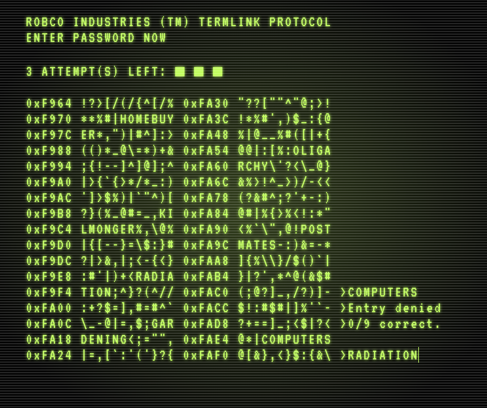
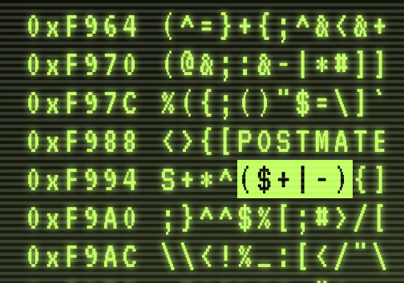

# Termlink

### A Fallout 3/NV hacking minigame - on the web.

## Inspiration
I'm a big fan of the Bethesda Fallout game series. I've played countless hours of Fallout 3 and Fallout New Vegas as a kid and as an adult. Of all the various minigames presented in these games, I've always enjoyed the Terminal Hack the most. After a long hiatus from work, I was looking for a website idea and this one struck me as a fun project!

## The Game
The goal of this game is to find the password for the terminal you're hacking into. Scattered within the random characters of data are strings of words that represent a possible password. When you select a password (either by typing it in directly or clicking on one), if incorrect, the system will tell you how many characters matched with the actual password. A match occurs when a character occupies the same space as another character of the same letter in the actual password.

There are 4 attempts given initially to find the password. Alternatively, if you find any matching brackets in the data stream (ex: "\[...]" or "<...>" etc) triggering these will either remove a dud password or replenish your attempts.

Keep in mind that each bracket combination can only be triggered once and that opening brackets will only match to the FIRST closing bracket of the same kind it encounters. So for example `{,|-.}..}` there is only one valid matching combination.